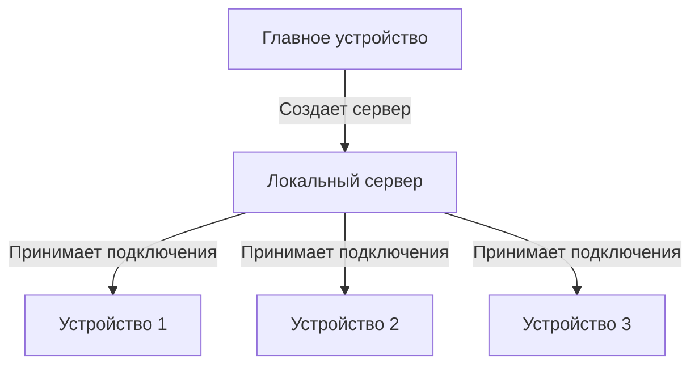

# 🖥️ ConsoleLocalServer

**Локальный сервер для контроля устройств в сети**  
*Идеальное решение для учебных заведений и офисов*

[📖 Описание](#-описание) • [🚀 Возможности](#-возможности) • [🛠️ Установка](#️-установка) • [📋 Использование](#-использование) • [🎯 Сценарии применения](#-сценарии-применения)

## 📖 Описание

**ConsoleLocalServer** — это профессиональное решение для создания локальных серверов и контроля подключенных устройств в пределах одной сети. Программа разработана специально для образовательных учреждений и офисов, где необходим мониторинг активности компьютеров.

Как это выглядит?:

##🚀 Возможности=============================

